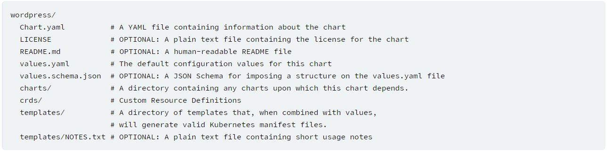

# Charts Templating
- [Charts Templating](#charts-templating)
  - [Basics](#basics)
  - [Built-in Objects](#built-in-objects)
  - [Value files](#value-files)
  - [Templates, Functions and Pipelines](#templates-functions-and-pipelines)
    - [Templates](#templates)
    - [Pipelines](#pipelines)
    - [Lookup function](#lookup-function)
  - [Flow control](#flow-control)
  - [Variables](#variables)
  - [Named Templates](#named-templates)
    - [Partials and _ files](#partials-and--files)
    - [define](#define)
    - [Templates](#templates-1)
      - [The `include` function](#the-include-function)
  - [Files](#files)


## Basics
- A chart is organized as a collection of files inside of a directory


- The **templates/** directory is for template files that helm renders through template rendering engine and send it to kubernetes
- The **values.yaml** contains value for a chart
- **Chart.yaml** contains description of the chart. **charts** directory contains other charts(**subcharts**)
- ```helm get manifest <release-name>``` takes a release name and prints out all the kubernetes resources that were uploaded to the server
  - Each file begins with **---**
  - Followed by an automatically generated comment line that tells us what template file generated this YAML document.
- ```helm list``` - lists all the release in helm

## Built-in Objects 
- Objects are passed into template from the templating engine
- Objects can have one value, a function or another object
- [Link for the preset object](https://helm.sh/docs/chart_template_guide/builtin_objects/)
- The built-in values always begin with a capital letter

## Value files
- Content of **Value** object can come from multiple sources.
  - **values.yml** file
  - **values.yml** of parent if this is a subchart
  - passed through command line - ```helm install -f myvals.yaml ./mychart```
  - ```set``` parameter - ```helm install --set foo=bar ./mychart```
- Above list is in order of specificity. 
  - **values.yaml** is the default, which can be overridden by a parent chart's **values.yaml**, which can in turn be overridden by a user-supplied values file, which can in turn be overridden by ```--set``` parameters.
- To delete default key, just set it to ```null```

## Templates, Functions and Pipelines

### Templates
- Template function has the syntax of ```functionName arg1 arg2 ...```
- Total 60 available function in [Go template language](https://godoc.org/text/template) and [Sprig template library](https://masterminds.github.io/sprig/)

### Pipelines
- We can send the argument to the function using pipe ```|```
  - ```.Values.favoriteDrink | upper | quote```

### Lookup function
- ```lookup``` function can be used to look up resources in a running cluster
- When lookup returns an object, it will return a dictionary

```go
{{ range $index, $service := (lookup "v1" "Service" "mynamespace" "").items }}
    {{/* do something with each service */}}
{{ end }}
```

## Flow control
- If/Else
```go
{{ if PIPELINE }}
  # Do something
{{ else if OTHER PIPELINE }}
  # Do something else
{{ else }}
  # Default case
{{ end }}
```
- The **|-** marker in YAML takes a multi-line string. This can be a useful technique for embedding big blocks of data inside of your manifests, as exemplified here.
```yaml
sizes: |-
    {{- range tuple "small" "medium" "large" }}
    - {{ . }}
    {{- end }}
```
Above will produce
```yaml
sizes: |-
  - small
  - medium
  - large
```

## Variables

- Below code will fail as `.Release.Name` is out of scope
```yaml
  {{- with .Values.favorite }}
  drink: {{ .drink | default "tea" | quote }}
  food: {{ .food | upper | quote }}
  release: {{ .Release.Name }}
  {{- end }}
```
- One way to workaround is to define variable 
```yaml
apiVersion: v1
kind: ConfigMap
metadata:
  name: {{.Release.Name}}-config
data:
  myvalue: "Hello world"
  {{- $relName = .Release.Name -}} # delete this line totally when transpiling to yaml
  {{- with .Values.favorite }}
  drink: {{ .drink | default "tea" | quote }}
  food: {{ .food | upper | quote }}
  release: {{ $relname }}
  {{- end }}
```

- Above will produce
```yaml
# Source: mychart/templates/configmap.yaml
apiVersion: v1
kind: ConfigMap
metadata:
  name: viable-badger-configmap
data:
  myvalue: "Hello World"
  drink: "coffee"
  food: "PIZZA"
  release: viable-badger
```
- Variables are useful in rarnge loop
```yaml
 toppings: |-
    {{- range $index, $topping := .Values.pizzaToppings }}
      {{ $index }}: {{ $topping }}
    {{- end }}
```

- there is one variable that is always global - `$` - this variable will always point to the root context

## Named Templates
- Template names are global
  -  If you declare two templates with the same name, whichever one is loaded last will be the one used
- Define template with the name of the chart: `{{ define "mychart.labels" }}

### Partials and _ files
- Files beginning with `_` are not rendered to kubernetes object definition, and are available to other charts for use.
  - These files are used for partials and helpers

### define
- The define action allows us to create a named template inside of a template file
```yaml
{{ define "mychart.labels"}}
  labels:
    generator: helm
    date: {{ now | htmlDate }}
{{end}}
```

### Templates
- [Checkout template in depth](https://helm.sh/docs/chart_template_guide/named_templates/)
- **template** is an action, and not a function, there is no way to pass the output of a template call to other functions; the data is simply inserted inline.
  - To work around this case, Helm provides an alternative to template that will import the contents of a template into the present pipeline where it can be passed along to other functions in the pipeline
#### The `include` function

```yaml
{{- define "mychart.app" -}}
app_name: {{ .Chart.Name }}
app_version: "{{ .Chart.Version }}"
{{- end -}}

apiVersion: v1
kind: ConfigMap
metadata:
  name: {{ .Release.Name }}-configmap
  labels:
    {{ template "mychart.app" . }}
data:
  myvalue: "Hello World"
  {{- range $key, $val := .Values.favorite }}
  {{ $key }}: {{ $val | quote }}
  {{- end }}
{{ template "mychart.app" . }}
```
- Output of above will be
```yaml
# Source: mychart/templates/configmap.yaml
apiVersion: v1
kind: ConfigMap
metadata:
  name: measly-whippet-configmap
  labels:
    app_name: mychart
app_version: "0.1.0+1478129847"
data:
  myvalue: "Hello World"
  drink: "coffee"
  food: "pizza"
  app_name: mychart
app_version: "0.1.0+1478129847" # this is not what is expected, indentation is lost when using template as it just injects the data inline
```
- Using `include`
```yaml
apiVersion: v1
kind: ConfigMap
metadata:
  name: {{ .Release.Name }}-configmap
  labels:
{{ include "mychart.app" . | indent 4 }}
data:
  myvalue: "Hello World"
  {{- range $key, $val := .Values.favorite }}
  {{ $key }}: {{ $val | quote }}
  {{- end }}
{{ include "mychart.app" . | indent 2 }} # this will pipe the output to indent function which will then add two spaces
```

- Output of above will be
```yaml
# Source: mychart/templates/configmap.yaml
apiVersion: v1
kind: ConfigMap
metadata:
  name: edgy-mole-configmap
  labels:
    app_name: mychart
    app_version: "0.1.0+1478129987"
data:
  myvalue: "Hello World"
  drink: "coffee"
  food: "pizza"
  app_name: mychart
  app_version: "0.1.0+1478129987"
```

## Files
- Provides access through `.Files` Object.
- The extra files added will be bundled. 
  - ***Note*** : Charts must be smaller than **1M** because of the storage limitations of Kubernetes objects
- Inaccessible files through `.Files` object:
  - `template/*`
  - files listed in `.helmignore`
- Do not preserve unix mode information, so file-level permission will have no impact on availibility of file.
- There is no way to pass files external to chart during installation