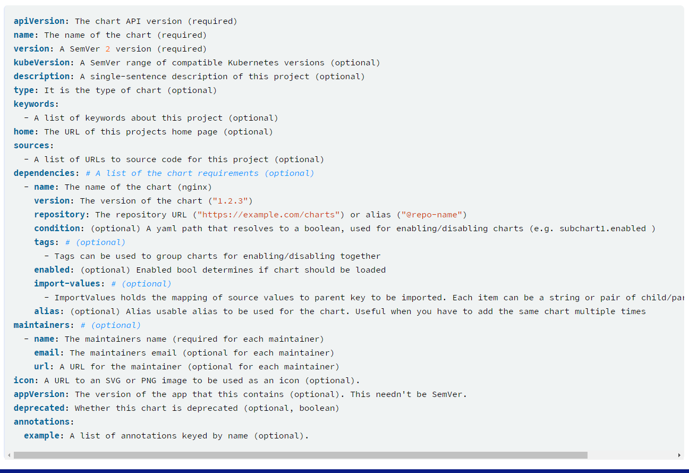
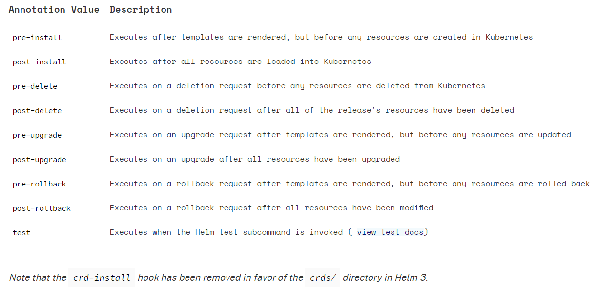

# Charts
- [Charts](#charts)
  - [Chart.yml](#chartyml)
  - [Chart types](#chart-types)
  - [Chart dependancies](#chart-dependancies)
    - [Tags and conditional fields](#tags-and-conditional-fields)
      - [Tags and Condition Resolution](#tags-and-condition-resolution)
    - [Importing child values via dependancies](#importing-child-values-via-dependancies)
      - [Import Export](#import-export)
      - [child-parent format](#child-parent-format)
    - [Scopes, Dependancies and Values](#scopes-dependancies-and-values)
      - [Values](#values)
        - [Global Values](#global-values)
  - [Chart Hooks](#chart-hooks)

## Chart.yml
- Chart.yml file is required for the chart


## Chart types
- Two types of charts
  - Application
    - Normal application charts, where all objects will get loaded
    - Installable
    - **Note**: An application can be used as library, but the objects won't get loaded in that case
  - Library
    - Provides as utility or functions for chart builder
    - Non installable

## Chart dependancies
- Managing dependacies with `dependancies` field
```yaml
dependancies:
  - name: apache
    version: 2.3.1
    alias: server # optional alias field, where we need to access chart with other name
    repository: http://example/apache # remote repo
  - name: mysql # name of the chart that is needed
    version: 5.2.0 # version of the chart needed
    repository: "@mysql-repo" # locally added repo with helm add and given name of mysql-repo 
```
- `helm dep up foochart` - will update foochart
- When above command retrieves charts it will store them as chart archives in `charts/` directory.
### Tags and conditional fields
- **Tag** - The `tags` field is a YAML list of labels to associate with this chart in top parent's **values**.
- All the charts with tags can be enabled or disabled, by specifying tag and boolean value
- **Condition** - The condition field holds one or more YAML path(comma seperated).
  - If this path exists in the top parent's **values** and resolves to a boolean value, the chart will be enabled or disabled based on that boolean value. 
  - Only the first valid path found in the list is evaluated and if no paths exist then the condition has no effect
```yaml
# parentchart/Chart.yaml
dependencies:
  - name: subchart1
    repository: http://localhost:10191
    version: 0.1.0
    condition: subchart1.enabled, global.subchart1.enabled # check if subchart1 is enabled
    tags:
      - front-end
      - subchart1
  - name: subchart2
    repository: http://localhost:10191
    version: 0.1.0
    condition: subchart2.enabled,global.subchart2.enabled
    tags:
      - back-end
      - subchart2
      
# parentchart/values.yaml
subchart1:
  enabled: true # specific chart is enabled, will overwrite tags (i.e. front-end )value.
tags:
  front-end: false # chart with tag front-end is disabled
  back-end: true      
```
#### Tags and Condition Resolution
- Conditions (when set in values) always override tags. The first condition path that exists wins and subsequent ones for that chart are ignored.
- Tags are evaluated as 'if any of the chart's tags are true then enable the chart'.
- Tags and conditions values must be set in the top parent's values.
- The `tags:` key in values must be a top level key. Globals and nested `tags:` tables are not currently supported.

### Importing child values via dependancies
- Child chart's values to propagate to the parent chart and be shared as common defaults
- Two ways to import child values

#### Import Export
```yaml

# parent's Chart.yaml file
dependencies:
  - name: subchart
    repository: http://localhost:10191
    version: 0.1.0
    import-values:
      - data

# child's values.yaml file
exports:
  data:
    myint: 99
```

Above will result in final parent's values to contain
```yaml
# parent's values
myint: 99
```

#### child-parent format
- To access values that are not in `exports` field of child's values
  - Need to specify source key `child` to be imported
  - And destination path `parent`
```yaml
# parent's Chart.yaml file

dependencies:
  - name: subchart1
    repository: http://localhost:10191
    version: 0.1.0
    ...
    import-values:
      - child: default.data # take values from childs values.default.data
        parent: myimports # and populate parents myimports

#Parents initial values
myimports:
  myint: 0
  mybool: false
  mystring: "helm rocks!"

#childs values
default:
  data:
    myint: 999
    mybool: true

# final parent's values
myimports:
  myint: 999
  mybool: true
  mystring: "helm rocks!"
```

### Scopes, Dependancies and Values
#### Values
- **Values file** declares values for top level charts and for the any charts in `charts/` directory.
```yaml
# values file
title: "My WordPress Site" # Sent to the WordPress template

mysql:
  max_connections: 100 # Sent to MySQL
  password: "secret"

apache:
  port: 8080 # Passed to Apache
```
- Values are namespaced, but namespaces are pruned
  - In above scenario, parent can access all the properties
  - `mysql` dependancy can only access values defined in `mysql:` block

##### Global Values
```yaml
title: "My WordPress Site" # Sent to the WordPress template

global:
  app: MyWordPress

mysql:
  max_connections: 100 # Sent to MySQL
  password: "secret"

apache:
  port: 8080 # Passed to Apache
```
- If a subchart declares a global variable, that global will be passed downward (to the subchart's subcharts), but not upward to the parent chart. 
- There is no way for a subchart to influence the values of the parent chart.

## Chart Hooks
- Hooks can be used for
  - Load a `ConfigMap` or `Secret` during install before any other charts are loaded.
  - Execute a Job to back up a database before installing a new chart, and then execute a second job after the upgrade in order to restore data.
  - Run a Job before deleting a release to gracefully take a service out of rotation before removing it.
- Available Hooks:


